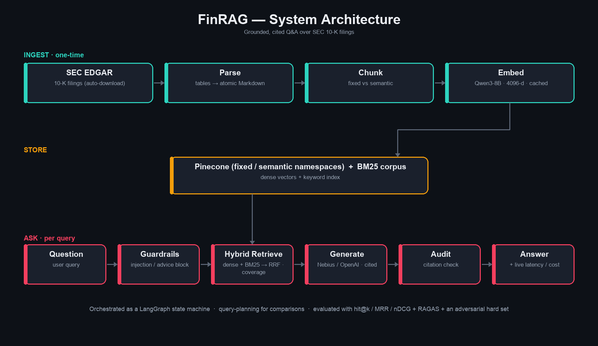

# FinRAG — Financial Document Intelligence (RAG)

### 🚀 Live demo: **https://aadhavanalakan-finrag-app-eadpfy.streamlit.app**

[](https://aadhavanalakan-finrag-app-eadpfy.streamlit.app)

A Retrieval-Augmented Generation system that answers natural-language questions about
**SEC 10-K filings** with **grounded, cited** answers — and *measures* which design
choices actually help. It ships as a **Streamlit chatbot** with live cost/latency
metrics, multi-model switching, guardrails, and runtime corpus management, on top of a
rigorous evaluation harness.

> Built around two measured comparisons — **fixed vs. semantic chunking** and the
> **impact of reranking** — plus an adversarial **failure analysis**.
> Full write-up: **[REPORT.md](REPORT.md)** · failure analysis: **[eval/FAILURE_ANALYSIS.md](eval/FAILURE_ANALYSIS.md)** ·
> formatted doc: **[DOCUMENTATION.docx](DOCUMENTATION.docx)** (regenerate with `python -m scripts.generate_docs`)

---

## What you get

- **💬 Chatbot UI** ([app.py](app.py)) — ask questions in a chat interface with a live
  metrics strip on every answer: **latency · time-to-first-token · tokens/sec · input/output
  tokens · cost**, plus a running session cost meter and an expandable **Sources** panel.
- **🔀 Model switching** — pick the answer model per query: open models on Nebius
  (Qwen3-30B, Llama-3.3-70B, gpt-oss-120b, Gemma) or OpenAI (GPT-4o / GPT-4o-mini). A
  model appears only if its API key is set.
- **🛡️ Guardrails** ([finrag/guardrails.py](finrag/guardrails.py)) — deterministic, no
  extra LLM call. **Input**: blocks prompt-injection / instruction-extraction, deflects
  investment-advice solicitation, caps length. **Output**: audits every `[chunk:id]`
  citation against real sources (flags invented references + ungrounded answers).
- **🧩 LangGraph orchestration** ([finrag/graph.py](finrag/graph.py)) — the flow is a
  compiled state machine: `guard → retrieve → generate → audit`, with a conditional edge
  that short-circuits a blocked input to the end (zero cost).
- **🏢 Runtime corpus management** — add any US-listed company with a 10-K by ticker
  (validated against SEC EDGAR), or remove one — from the CLI or the sidebar. The corpus
  is data, not code ([data/companies.json](data/companies.json)).
- **📊 Evaluation harness** — retrieval metrics (Hit@k, MRR, nDCG), generation metrics
  (correctness, faithfulness via LLM-judge, refusal accuracy), a reranking study, a model
  benchmark, and an **adversarial hard set** with a generated failure analysis.

## Key findings (all measured, see `results/`)

- **Semantic, table-aware chunking wins** — retrieval hit@5 **0.688 vs 0.562**, answer
  **faithfulness 0.974 vs 0.904** (fixed-size chunking shreds financial tables, separating
  a figure like `$138,191` from its `Total Operating Revenues` label).
- **The off-the-shelf reranker *hurts*** — the MS-MARCO cross-encoder demotes table chunks;
  no mitigation beats no-reranking, so the production default is reranking **off**.
- **It's trustworthy under adversarial probing** — refuses unanswerable / forward-guidance
  questions and blocks injection/advice; **14/15** on the hard set, with the one miss a
  documented retrieval gap.

## Architecture



```
INGEST (once):  10-K HTML ─▶ parse (tables → atomic Markdown) ─▶ chunk (fixed AND semantic)
                          ─▶ embed (cached) ─▶ Pinecone (namespace per strategy) + BM25 corpus

ASK (per query):  question ─▶ [guard] ─▶ embed ─▶ hybrid retrieve (dense + BM25, RRF)
                           ─▶ [rerank?] ─▶ generate (cited, streamed) ─▶ [audit] ─▶ answer + metrics

EVAL:  golden set (retrieval + faithfulness)  ·  hard set (adversarial)  ·  CI gate
```

| Layer | Choice |
|---|---|
| Generation | Nebius open models (default `Qwen3-30B-A3B`) or OpenAI `gpt-4o`/`gpt-4o-mini`, temp 0 |
| Embeddings | Nebius `Qwen3-Embedding-8B` — 4096-dim, cosine, disk-cached |
| Vector store | Pinecone serverless, one namespace per chunking strategy |
| Retrieval | hybrid dense + BM25, fused with Reciprocal Rank Fusion (k=60) |
| Reranker | `ms-marco-MiniLM-L-12-v2` cross-encoder (local; off by default — measured to hurt) |
| Orchestration | LangGraph `StateGraph` (guard → retrieve → generate → audit) |
| UI | Streamlit |
| Config | versioned YAML + typed Pydantic loader + per-run manifest |

## Results

All numbers below are produced by the eval harness and persisted under `results/`, each
stamped with the config version that generated it. Full tables (mitigation study, model
benchmark, per-item hard set) are in [REPORT.md](REPORT.md) and [DOCUMENTATION.docx](DOCUMENTATION.docx).

**A · Chunking — retrieval** (no reranker confound, 16 answerable questions):

| arm | hit@1 | hit@3 | hit@5 | MRR | nDCG@5 |
|---|---|---|---|---|---|
| fixed_norerank | 0.250 | 0.375 | 0.562 | 0.353 | 0.404 |
| **semantic_norerank** | **0.375** | **0.562** | **0.688** | **0.483** | **0.523** |

**A · Chunking — generation** (LLM-judge):

| arm | correct | false-refuse | citation cov. | faithfulness | refuse acc. |
|---|---|---|---|---|---|
| fixed_norerank | 0.562 | 0.438 | 0.562 | 0.904 | 1.000 |
| **semantic_norerank** | **0.625** | **0.312** | **0.750** | **0.974** | 1.000 |

**B · Reranking impact** — the cross-encoder lowers every metric:

| arm | hit@5 | MRR | nDCG@5 |
|---|---|---|---|
| **semantic_norerank** | **0.688** | **0.483** | **0.523** |
| semantic_rerank | 0.375 | 0.158 | 0.211 |
| fixed_norerank | 0.562 | 0.353 | 0.404 |
| fixed_rerank | 0.438 | 0.190 | 0.251 |

**C · Model benchmark** (10 prompts × 4 Nebius models, streaming):

| model | TTFT p50 (s) | tok/s | latency p50 (s) | latency p95 (s) |
|---|---|---|---|---|
| **Qwen3-30B-A3B** (pipeline) | **0.592** | 95.0 | 2.55 | 3.17 |
| gemma-3-27b-it | 0.662 | 66.4 | 3.65 | 14.95 |
| Llama-3.3-70B | 0.742 | 19.7 | 11.15 | 22.97 |
| gpt-oss-120b | 0.817 | **690.7** | **1.06** | **1.32** |

**D · Adversarial hard set** — **14 / 15** met expected behavior; the one miss is a
documented retrieval gap (see [eval/FAILURE_ANALYSIS.md](eval/FAILURE_ANALYSIS.md)).

**E · RAGAS cross-check** (industry-standard metrics, gpt-4o-mini judge) — independently
confirms both findings: semantic beats fixed, and reranking *hurts*:

| arm | faithfulness | context_precision | context_recall |
|---|---|---|---|
| fixed_norerank | 0.439 | 0.382 | 0.521 |
| **semantic_norerank** | **0.681** | **0.436** | **0.583** |
| semantic_rerank | 0.573 | 0.218 | 0.375 |

## Setup

```bash
python -m venv .venv && source .venv/bin/activate
pip install -r requirements.txt
cp .env.example .env        # then add your keys (see below)
```

Required: `NEBIUS_API_KEY` (embeddings + open-model generation) and `PINECONE_API_KEY`
(vector store). Optional: `OPENAI_API_KEY` adds GPT-4o / GPT-4o-mini to the model
dropdown. The reranker runs locally (no key). **Never paste keys into chat or commit
`.env`** — it's git-ignored.

## Run

```bash
# Build the index (one-time): parse -> chunk -> embed -> upsert
python -m scripts.ingest

# Launch the chatbot
streamlit run app.py

# Or ask from the CLI
python -m scripts.ask "What were Verizon's total operating revenues in 2025?"
```

### Manage the corpus

```bash
python -m scripts.add_company TSLA META    # validate -> download 10-K -> index just these
python -m scripts.remove_company tsla       # delete its vectors + files + registry entry
```

The Streamlit sidebar's **➕ Manage corpus** panel does the same thing live. The three
seed telecoms are protected from removal so the graded eval set can't be broken.

### Evaluate

```bash
python -m eval.run_eval        # retrieval metrics (free)
python -m eval.run_eval_gen    # generation metrics (LLM)
python -m eval.rerank_study    # reranking mitigation study
python -m eval.run_hard        # adversarial hard set -> eval/FAILURE_ANALYSIS.md
python -m eval.run_ragas       # RAGAS-style metrics (faithfulness/precision/recall, gpt-4o-mini)
python -m benchmark.run_benchmark   # model speed comparison
python -m pytest tests/ && python -m eval.gate      # what CI runs
```

### Learn the pipeline

[walkthrough.ipynb](walkthrough.ipynb) is a guided, cell-by-cell notebook that
runs each stage (parse → chunk → embed → retrieve → rerank → generate → metrics) with
a help box above every cell.

## Layout

```
app.py        Streamlit chatbot (model switch · live metrics · sources · manage corpus)
finrag/       config · parsing · chunking · embedding · vectorstore · retrieval · reranking
              · generation · pipeline · chat · guardrails · graph · corpus · edgar
config/       models · chunking · pipeline · thresholds · answer_models · pricing · prompts/
eval/         metrics · faithfulness · run_eval · run_eval_gen · rerank_study · run_hard · run_ragas
              · gate · hard_queries.jsonl · FAILURE_ANALYSIS.md
scripts/      ingest · ask · add_company · remove_company · download_seed_filings · generate_docs
tests/        parsing · chunking · metrics · guardrails · corpus_hints   (offline; run in CI)
benchmark/    run_benchmark
data/         3 telecom 10-Ks · companies.json (registry) · golden/golden.jsonl
results/      persisted, version-stamped eval outputs
walkthrough.ipynb   guided notebook
DOCUMENTATION.docx  formatted project documentation (generated from results/)
```

## Design notes

- **Hybrid over pure dense.** Dense retrieval misses exact tokens that matter in filings
  — line-item names, literal dollar figures. BM25 catches those; RRF fuses both rankings.
- **Refusal first.** The generator answers *only* from retrieved context and returns a
  fixed refusal when it can't — verified on unanswerable and forward-guidance traps.
- **Two chunkers, one interface.** Both emit the same `Chunk` record, so retrieval /
  generation never care which strategy produced the data; the eval just builds both and
  compares.
- **Reproducibility.** Every config is versioned YAML; each run records the version +
  content hash, so any metric movement is attributable to one change. Prices in
  `config/pricing.yaml` are editable estimates — set real per-token values for an exact
  cost meter.
```
